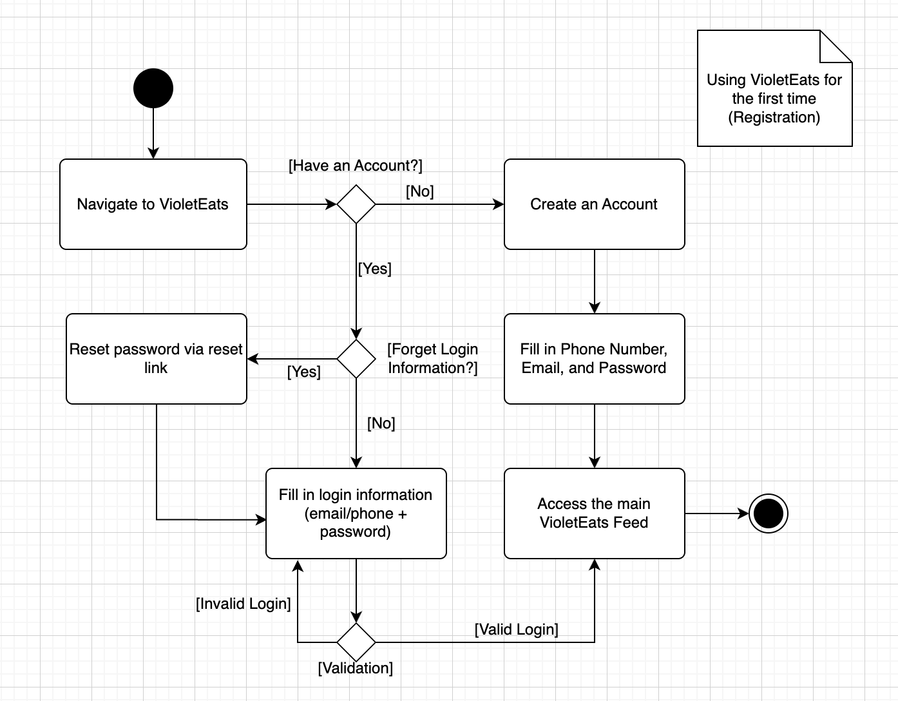
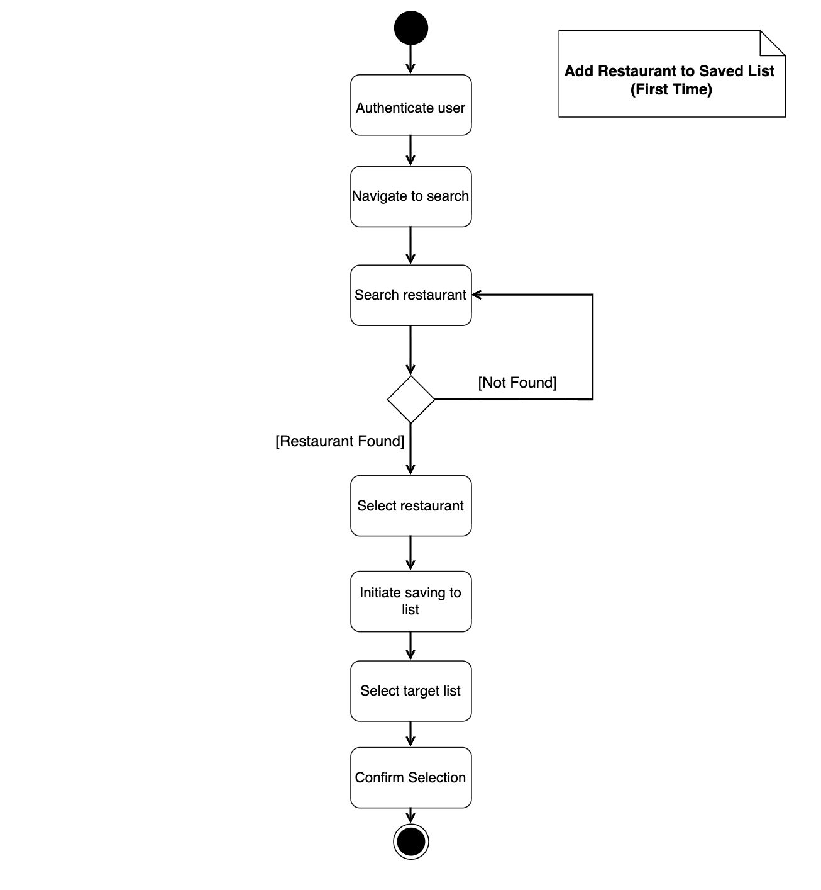

# VioletEats

[Click here](https://www.figma.com/proto/ucTxbALPp4mP2smV0djRKa/raccoons---wireframes?node-id=1-2&p=f&t=MOLVyP4BP2GqQzOA-1&scaling=scale-down&content-scaling=fixed&page-id=0%3A1&starting-point-node-id=1%3A2) to view our prototype. Only members of the `SWE - Spring 2026` group on Figma have access.

## Team members

- [Ethan](https://github.com/ethanarnold)
- [Tao](https://github.com/tx715)
- [Prabhav](https://github.com/prabhavjalan)
- [Andy](https://github.com/ethanarnold)

---

## Product Vision Statement

Our app helps NYU students quickly discover walkable restaurants that match their cravings by combining social recommendations with a low-effort, student-friendly browsing experience.

---

## Stakeholders & their goals/needs

### Stakeholder 1: Akhil Chava (NYU Student)

#### Goals/Needs

1. Find restaurants near campus quickly
2. Make optimal restaurant choices based on nutrition
3. Stay within budget as a student
4. Explore a wide range of restaurants

#### Frustrations/Problems

1. Hard to filter restaurants by diet and nutrition
2. Difficult to find nutritious meals at a reasonable price
3. Finding a new, good restaurant takes too much effort
4. Would like a wide range of restaurant selections: cheap and expensive
5. Existing apps are not user-friendly enough (too convoluted / gives too much information)

### Stakeholder 2: Aashi Doshi (NYU Student)

#### Goals/Needs

1. Discover new restaurants easily
2. See what friends/other students are interested in
3. Decide quickly with minimal effort
4. Find the right restaurant that matches current cravings

#### Frustrations/Problems

1. Too much effort required to find good options
2. Lack of personalized inspiration from existing apps
3. No food app is tailored to NYU students, so not a lot of great recommendations for on-campus restaurants

---

## User Requirements
*(A non-exhaustive list)*
- As a user, I want to create an account so that I can use the app.
- As a user, I want to log in with my email and password so that I can securely access my account.
- As a user, I want to reset my password so that I can regain access if I forget it.
- As a user, I want to change my password so that I can keep my account secure.
- As a user, I want to edit my profile information so that my account stays up to date.
- As a user, I want to upload a profile picture so that other users can recognize me.
- As a user, I want to log out so that my account is secure on shared devices.
- As a user, I want to see restaurants within walking distance of campus so that I can quickly decide where to eat between classes.
- As a user, I want to filter restaurants by dietary and nutrition preferences so that I can choose meals that fit my health goals.
- As a user, I want to see price ranges for restaurants so that I can stay within my budget.
- As a user, I want to browse restaurant menus in the app so that I can decide what to order before arriving.
- As a user, I want to make a reservation quickly through the app so that I don't have to switch to another platform.
- As a user, I want to see reviews and ratings from other users so that I can trust the recommendations.
- As a user, I want to see which restaurants my friends are interested in so that I can discover new places socially.
- As a user, I want to have a wide variety of selections so I can satisfy my cravings at any time.
- As a user, I want to discover new restaurants near campus so that I don't keep going to the same places.
- As a user, I want a simple and uncluttered interface so that choosing a restaurant is fast and stress-free.

---

## Activity Diagrams

### UML Activity Diagram: User Registration Workflow

---

## Clickable Prototype

[Click here](https://www.figma.com/proto/ucTxbALPp4mP2smV0djRKa/raccoons---wireframes?node-id=1-2&p=f&t=MOLVyP4BP2GqQzOA-1&scaling=scale-down&content-scaling=fixed&page-id=0%3A1&starting-point-node-id=1%3A2) to view our prototype. Only members of the `SWE - Spring 2026` group on Figma have access.

